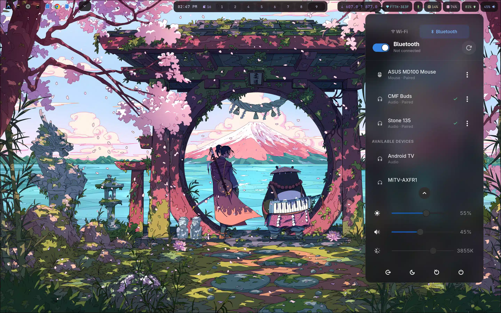
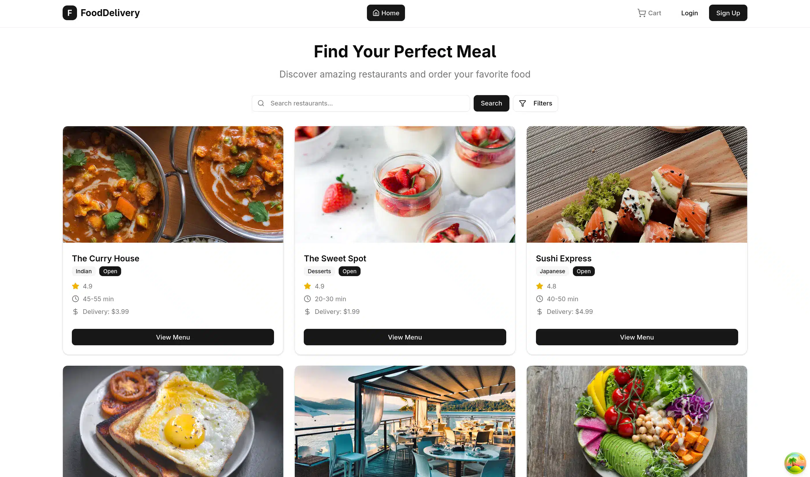
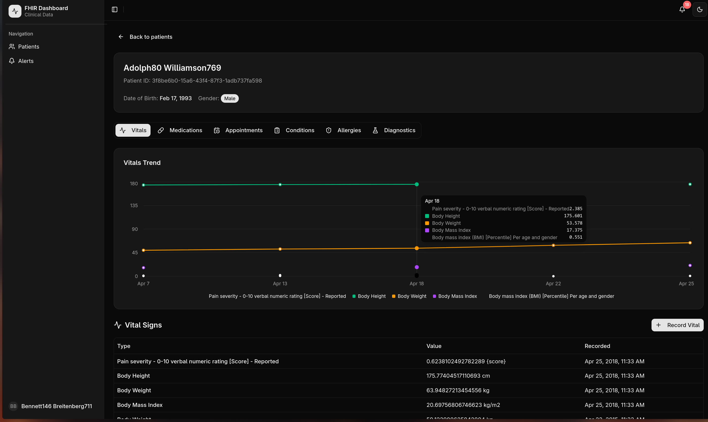
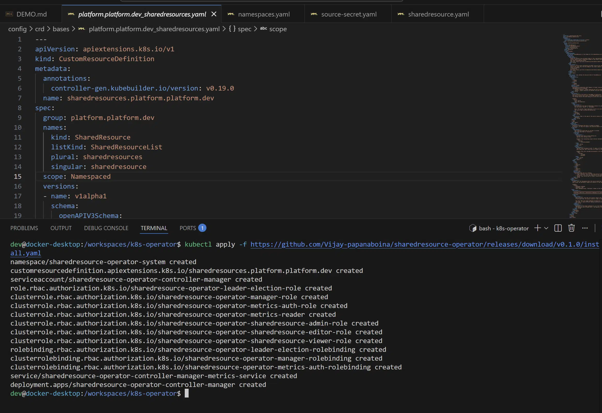
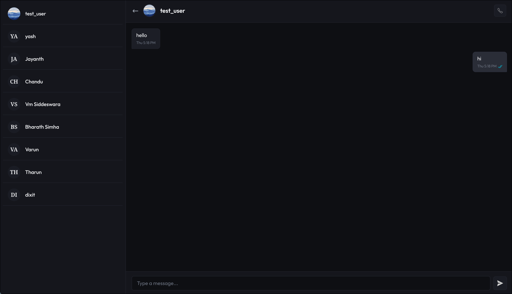
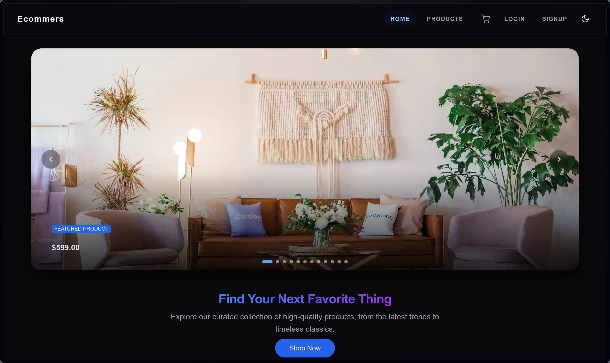
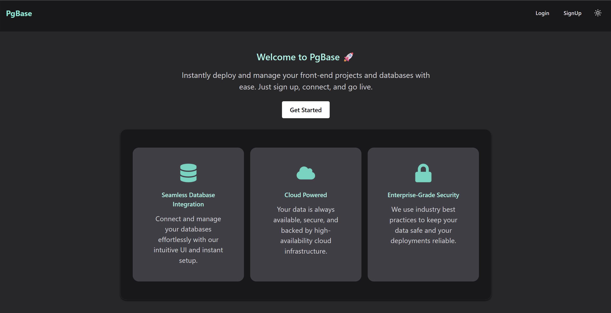
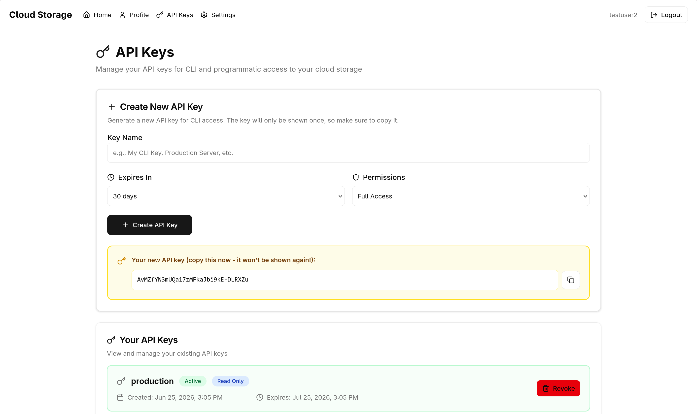

# Hi there, I'm Vijay 👋

I'm a **Full-Stack Developer** passionate about building scalable web applications with modern technologies. I specialize in microservices architecture, real-time communication, and cloud-native deployments.

  
  
   

  
  
  

---

## Tech Stack

### Frontend

### Backend

### Database

### DevOps & Cloud

### Real-time & Communication

---

## Featured Projects

### [Wayland Control Center](https://github.com/Vijay-papanaboina/wifi-manager)

<table width="100%">
  <tr>
    <td width="35%" align="center" valign="middle">
      
    </td>
    <td width="65%" valign="top" style="padding-left: 15px;">
      
A lightweight, native control center panel for Wayland compositors managing Wi-Fi, Bluetooth, system audio/brightness, display warmth, and power controls for tiling window managers like sway, hyprland, niri.

      <ul>
        <li>Real-time NetworkManager and BlueZ state updates via asynchronous D-Bus signal subscriptions.</li>
        <li>Hardware adjustments (volume, brightness, color temperature, system power states) utilizing layer-shell overlays and native backend APIs.</li>
      </ul>
      

        
        
        
        
      

    </td>
  </tr>
</table>

 

### [Food Delivery Platform](https://github.com/Vijay-papanaboina/Food-Delivery-Backend)

<table width="100%">
  <tr>
    <td width="35%" align="center" valign="middle">
      
    </td>
    <td width="65%" valign="top" style="padding-left: 15px;">
      
A comprehensive food ordering system with <strong>microservices architecture</strong> and <strong>Apache Kafka</strong> event-driven communication.

      <ul>
        <li>6 microservices: User, Order, Payment, Restaurant, Delivery, and Notification services.</li>
        <li>Real-time order lifecycle tracking and timeline visualization.</li>
      </ul>
      

        
        
        
        
        
      

    </td>
  </tr>
</table>

 

### [Frontbase](https://github.com/Vijay-papanaboina/Frontbase-Backend)

<table width="100%">
  <tr>
    <td width="35%" align="center" valign="middle">
      
    </td>
    <td width="65%" valign="top" style="padding-left: 15px;">
      
Self-hosted deployment platform for static frontend apps with <strong>GitHub integration</strong> and <strong>Cloudflare R2</strong> storage.

      <ul>
        <li>GitHub Action deployment workflows, secret injection with public-key crypto, and ZIP extraction.</li>
        <li>Subdomain mapping and static file distribution via Cloudflare Workers and KV routing.</li>
      </ul>
      

        
        
        
        
      

    </td>
  </tr>
</table>

 

### [CareSync Healthcare Platform](https://github.com/Vijay-papanaboina/FHIR-MERN)

<table width="100%">
  <tr>
    <td width="35%" align="center" valign="middle">
      
    </td>
    <td width="65%" valign="top" style="padding-left: 15px;">
      
A healthcare monorepo mapping patient observations to the standard HL7 FHIR specification with real-time analytics.

      <ul>
        <li>Express middleware guards and observation webhook signature verification using secure secret tokens.</li>
        <li>Real-time observation alerts pushed to the clinician dashboard via Server-Sent Events (SSE).</li>
      </ul>
      

        
        
        
        
      

    </td>
  </tr>
</table>

 

### [Group Video Conferencing Platform](https://github.com/Vijay-papanaboina/VideoChat)

<table width="100%">
  <tr>
    <td width="35%" align="center" valign="middle">
      
    </td>
    <td width="65%" valign="top" style="padding-left: 15px;">
      
WebRTC-based group video calling with room management and screen sharing.

      <ul>
        <li>Native WebRTC SDP/ICE candidates signaling and responsive video layouts (up to 100 users).</li>
        <li>Password-protected rooms, custom participant controls, and text messaging chat history.</li>
      </ul>
      

        
        
        
        
      

    </td>
  </tr>
</table>

 

### [SharedResource K8s Operator](https://github.com/Vijay-papanaboina/sharedresource-operator)

<table width="100%">
  <tr>
    <td width="35%" align="center" valign="middle">
      
    </td>
    <td width="65%" valign="top" style="padding-left: 15px;">
      
A Kubernetes operator built in Go to securely and auditably synchronize Secrets and ConfigMaps across namespaces.

      <ul>
        <li>Continuous reconciliation loop with self-healing drift detection and checksum-based writes.</li>
        <li>Granular key filtering (includes/excludes) and configurable namespace replication strategies.</li>
      </ul>
      

        
        
        
      

    </td>
  </tr>
</table>

 

### [Real-Time Chat & Audio Calling App](https://github.com/Vijay-papanaboina/Chat-App-Frontend)

<table width="100%">
  <tr>
    <td width="35%" align="center" valign="middle">
      
    </td>
    <td width="65%" valign="top" style="padding-left: 15px;">
      
Feature-rich messaging app with <strong>WebRTC</strong> video/audio calls and <strong>Socket.io</strong> real-time messaging.

      <ul>
        <li>Real-time user presence tracking, unread badges, double-ticking, and Firebase Cloud Messaging (FCM) push alerts.</li>
        <li>Offline PWA support, modular client state management, and Supabase integration.</li>
      </ul>
      

        
        
        
        
      

    </td>
  </tr>
</table>

 

### [Furniture E-Commerce Store](https://github.com/Vijay-papanaboina/Ecommerce-Frontend)

<table width="100%">
  <tr>
    <td width="35%" align="center" valign="middle">
      
    </td>
    <td width="65%" valign="top" style="padding-left: 15px;">
      
Full e-commerce platform with <strong>Razorpay</strong> payment integration and guest cart support.

      <ul>
        <li>LocalStorage guest cart synchronization and automatic cart merge upon user login.</li>
        <li>Responsive product directory filters, image carousels, and verified signature signature check.</li>
      </ul>
      

        
        
        
      

    </td>
  </tr>
</table>

 

### [PGBase - PostgreSQL Deployment Platform](https://github.com/Vijay-papanaboina/PGBase-Frontend)

<table width="100%">
  <tr>
    <td width="35%" align="center" valign="middle">
      
    </td>
    <td width="65%" valign="top" style="padding-left: 15px;">
      
Self-hosted platform for containerized PostgreSQL databases on Oracle VM.

      <ul>
        <li>Docker container initialization API and dynamic database user provision flows.</li>
        <li>Automatic port allocation starting from port 4000 and reverse proxy routing via NGINX.</li>
      </ul>
      

        
        
        
        
      

    </td>
  </tr>
</table>

 

### [Cloud Storage Platform](https://github.com/Vijay-papanaboina/cloud-storage-api)

<table width="100%">
  <tr>
    <td width="35%" align="center" valign="middle">
      
    </td>
    <td width="65%" valign="top" style="padding-left: 15px;">
      
A multi-component cloud storage application featuring a Spring Boot REST API, a responsive web dashboard, and a Go CLI tool.

      <ul>
        <li>JWT-based authentication with cookie token rotation and role-based access control (RBAC).</li>
        <li>Interactive CLI for file/folder actions, secure local config formatting, and custom CLI build variables.</li>
      </ul>
      

        
        
        
        
      

    </td>
  </tr>
</table>

 

### [Threads Social Media Clone](https://github.com/Vijay-papanaboina/Threads-frontend)

<table width="100%">
  <tr>
    <td width="35%" align="center" valign="middle">
      
    </td>
    <td width="65%" valign="top" style="padding-left: 15px;">
      
A responsive social media platform inspired by Twitter and Threads, featuring real-time feeds, user interactions, and chat.

      <ul>
        <li>Authenticated flows via JWT and Google OAuth 2.0 with email registration validation.</li>
        <li>Optimistic state updates on social actions (likes, comments) using a hybrid state cache.</li>
      </ul>
      

        
        
        
        
      

    </td>
  </tr>
</table>

---

## 📊 GitHub Stats

  

  

